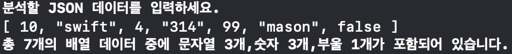
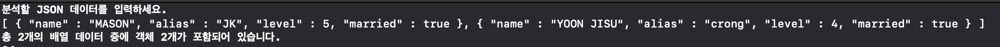
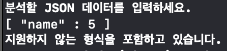
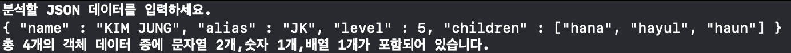
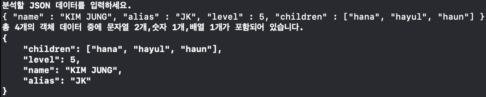

# JSON Parser

> JSON 포맷의 파일 또는 사용자의 JSON 문자열을 입력받고 이를 분석하는 JSON Parser를 별도의 클래스나 API를 사용하지 않고, Swift의 기본 타입만을 가지고 직접구현한다.

- 요구사항에 대한 구현을 완료한 후 자신의 github 아이디에 해당하는 브랜치에 Pull Request(이하 PR)를 통해 코드 리뷰 요청을 한다.
- 코드 리뷰 피드백에 대한 개선 작업을 하고 다시 PUSH한다.
- 모든 피드백을 완료하면 다음 단계를 도전하고 앞의 과정을 반복한다.

## 요구사항

### Step1. 단순 List 분석
- JSON 데이터 규격을 이해하고, JSON 데이터를 분석해서 원하는 데이터 구조 형태로 변환하는 분석기를 개발한다.
- 사용자가 JSON 문자열을 입력하는 메뉴를 구성한다.
- 입력한 문자열을 분석해서 처리하는 프로그램을 작성한다.
- 구조체 이름을 스스로 결정해본다.
- 지원하는 규격이 아닌 경우 처리하지 않는 예외처리 로직을 추가한다.

#### 구현화면

---

### Step2. Object 분석
- 사용자가 입력하는 메뉴를 객체(Object) 형식도 입력할 수 있도록 개선한다.
- 지원하는 규격이 아닌 경우 처리하지 않는 예외처리 로직을 추가한다.
- 마찬가지로 정규표현식을 사용하지 않고 최대한 직접 문자열을 처리한다.

#### 구현화면

---

### Step3. 규칙검사하기
- JSON 문법 규칙이 맞는지 여부를 정확하게 판단하기 위한 규칙 검사기능을 추가한다.
규칙 검사를 위해 정규표현식(Regular Expression)에 대해 학습한다.

#### 구현화면

---

### Step4. 중첩(Nested) 구조 분석
- JSON 객체 내에 배열이나 객체가 한단계 포함(Nested)된 경우를 지원하도록 개선한다.
- JSON 배열 내에 배열이 한단계 포함(Nested)된 경우도 지원하도록 개선한다.
- 메소드가 너무 많은 일을 하지 않도록 분리하기 위해 노력해 본다.
- 각 객체의 역할과 책임을 구분하도록 노력해 본다.
- 중첩된 형태 JSON 객체(object) 문자열을 입력하면 내부 요소들을 분석해서 배열 또는 사전(Dictionary)으로 저장하도록 구현한다.

#### 구현화면

---

### Step5. JSON 문자열 생성
- JSON 배열이나 객체를 스위프트 배열이나 사전으로 바꾼 데이터를 기준으로, JSON 문자열을 생성하도록 구현한다.
- 메소드가 너무 많은 일을 하지 않도록 분리하기 위해 노력해 본다.
- 변환한 문자열은 JSON 문법 검사 사이트처럼 배열은 한 줄로 붙여서 표현하고, 객체는 키-값을 다음줄로 내려서 표현한다.

#### 구현화면

## 코드리뷰 피드백 개선 사항
- computed property로 하는 것과 static 이나 let 상수로 만드는 것과 어떤 차이가 있을까요?
	- 계속 일정한 값을 주는 것이라면 computed property로 계속 값을 새로 주는 것이 아니라 static이나 let 상수로 만드는 것을
- Data 라는 타입은 Foundation에 있는 타입이라서 동일한 이름을 쓰면 혼란을 줄 수 있습니다. 일반 명사는 애플이 쓰는 경우가 많아요. 그래서 좀더 구체적인 이름을 쓰는게 좋습니다.
	- 기존에 스위프트에서 사용되고 있는 타입의 네이밍을 피해서 구체적인 이름을 쓰기
- 지금 구조에서는 lexer가 일반적인 lexer+parser 역할을 하고있고 parser는 token으로 카운트는 하는 counter 역할을 하고 있습니다.
	- Lexer와  Parser의 역할과 구조 개선
	  	- Lexer: 들어온 문자열을 의미있는 단위로 끊어 token(문자열)들을 분리하여 Parser에 넘겨줍니다.
		- Parser: token을 JSON 배열에 포함될 수 있는 Data로 구분합니다.
- 그리고 각 추상화 객체는 동일한 인터페이스(프로토콜)을 갖도록 설계하는 게 추상화의 기본입니다.
스위프트에서 추상화는 프로토콜과 클래스 상속으로 표현할 수 있습니다.
	- Lexer, Parser, OutputView사이의 프로토콜 구현
	- JSONData 프로토콜구현 -> 프로토콜 객체 : ArrayJSONData, ObjectJSONData
- 프로토콜을 파일 하나로 모아 놓는게 관리상 편리할 수 있습니다. 코드를 읽는 흐름상으로는 관련있는 객체나 프로토콜, 익스텐션이 가까운 곳에 (혹은 같은 파일에) 선언되어 있는게 좋습니다.
	- 문법검사 시 Error나 InputView의 enum 타입처럼 파일스페이스나 네임스페이스를 활용
- 위 문장을 쓰고보니 `position < self.tokenData.numberOfToken()` 코드가 보이는데
  값을 numberOfToken()으로 가져오기 보다는 `availableNextToken(position)`형태로 객체에 값을 주고 판단하도록 메시지를 보내주는 방식으로 개선해보세요.
  - 코드를 짜면서`numberOfToken()`의 메서드가 객체의 프로퍼티의 자체값을 넘겨주기 때문에 찜찜했는데 수정했습니다. Parser가 그 넘겨진 값을 통해 하는일이 position에 따라 다음토큰을 가져올지를 판단하기 위해 `비교`하는거였는데 비교 자체를 객체에게 하고 결과값을 Parser가 사용하게 수정했습니다.
- 공통된 객체를 상속을 사용하지 않고 protocol로 묶고 default implementation을 사용
